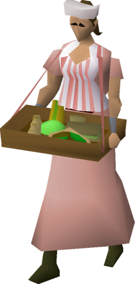

<!-- PROJECT SHIELDS -->
<!-- https://www.markdownguide.org/basic-syntax/#reference-style-links -->

[![Issues][issues-shield]][issues-url]
[![Stargazers][stars-shield]][stars-url]
[![Forks][forks-shield]][forks-url]
[![Contributors][contributors-shield]][contributors-url]

<!-- PROJECT LOGO -->
 
  

<h3 align="center">Sandwich lady</h3>

  

    You look hungry to me. I tell you what - have a Discord Role on me.
     
    <a href="https://github.com/manc1n1/sandwich-lady"><strong>Explore the docs »</strong></a>
     
     
    <a href="https://github.com/manc1n1/sandwich-lady">View Demo</a>
    ·
    <a href="https://github.com/manc1n1/sandwich-lady/issues">Report Bug</a>
    ·
    <a href="https://github.com/manc1n1/sandwich-lady/issues">Request Feature</a>
  

<!-- TABLE OF CONTENTS -->

  
Table of Contents

  <ol>
    <li>
      <a href="#about-the-project">About The Project</a>
      <ul>
        <li><a href="#built-with">Built With</a></li>
      </ul>
    </li>
    <li><a href="#contributing">Contributing</a></li>
    <li><a href="#license">License</a></li>
    <li><a href="#contact">Contact</a></li>
    <li><a href="#acknowledgments">Acknowledgments</a></li>
  </ol>

<!-- ABOUT THE PROJECT -->

## About The Project

Discord bot that will assign a role determined by a player's total level on the [Old School RuneScape](https://oldschool.runescape.com/) [Hiscores](https://secure.runescape.com/m=hiscore_oldschool/).

(<a href="#readme-top">back to top</a>)

### Built With

[![nodejs][node.js]][nodejs-url] 
[![discordjs][discord.js]][discordjs-url] 
[![sqlite][sqlite]][sqlite-url]

(<a href="#readme-top">back to top</a>)

<!-- CONTRIBUTING -->

## Contributing

Contributions are what make the open source community such an amazing place to learn, inspire, and create. Any contributions you make are **greatly appreciated**.

If you have a suggestion that would make this better, please fork the repo and create a pull request. You can also simply open an issue with the tag "enhancement".
Don't forget to give the project a star! Thanks again!

1. Fork the Project
2. Create your Feature Branch (`git checkout -b feature/AmazingFeature`)
3. Commit your Changes (`git commit -m 'Add some AmazingFeature'`)
4. Push to the Branch (`git push origin feature/AmazingFeature`)
5. Open a Pull Request

(<a href="#readme-top">back to top</a>)

<!-- LICENSE -->

## License

[![ISC License][license-shield]][license-url]

(<a href="#readme-top">back to top</a>)

<!-- CONTACT -->

## Contact

[![Gmail][gmail-shield]][gmail-url] 
[![X][x-shield]][x-url] 
[![LinkedIn][linkedin-shield]][linkedin-url] 

(<a href="#readme-top">back to top</a>)

<!-- ACKNOWLEDGMENTS -->

## Acknowledgments

-   [Node.js](https://nodejs.org/)
-   [Discord](https://discord.com/developers)
-   [Discord.js](https://discord.js.org/)
-   [osrs-json-highscores](https://github.com/maxswa/osrs-json-hiscores)

(<a href="#readme-top">back to top</a>)

<!-- MARKDOWN LINKS & IMAGES -->
<!-- https://www.markdownguide.org/basic-syntax/#reference-style-links -->

[contributors-shield]: https://img.shields.io/github/contributors/manc1n1/sandwich-lady.svg?style=for-the-badge
[contributors-url]: https://github.com/manc1n1/sandwich-lady/graphs/contributors
[forks-shield]: https://img.shields.io/github/forks/manc1n1/sandwich-lady.svg?style=for-the-badge
[forks-url]: https://github.com/manc1n1/sandwich-lady/network/members
[stars-shield]: https://img.shields.io/github/stars/manc1n1/sandwich-lady.svg?style=for-the-badge
[stars-url]: https://github.com/manc1n1/sandwich-lady/stargazers
[issues-shield]: https://img.shields.io/github/issues/manc1n1/sandwich-lady.svg?style=for-the-badge
[issues-url]: https://github.com/manc1n1/sandwich-lady/issues
[license-shield]: https://img.shields.io/github/license/manc1n1/sandwich-lady.svg?style=for-the-badge
[license-url]: https://github.com/manc1n1/sandwich-lady/blob/master/LICENSE.md
[gmail-shield]: https://img.shields.io/badge/Gmail-D14836?style=for-the-badge&logo=gmail&logoColor=white
[gmail-url]: mailto:mancinij1111@gmail.com
[linkedin-shield]: https://img.shields.io/badge/linkedin-%230077B5.svg?style=for-the-badge&logo=linkedin&logoColor=white
[linkedin-url]: https://linkedin.com/in/manc1n1
[x-shield]: https://img.shields.io/badge/X-%23000000.svg?style=for-the-badge&logo=X&logoColor=white
[x-url]: https://twitter.com/0xSuspext
[product-screenshot]: images/screenshot.png
[node.js]: https://img.shields.io/badge/node.js-6DA55F?style=for-the-badge&logo=node.js&logoColor=white
[nodejs-url]: https://nodejs.org/
[discord.js]: https://img.shields.io/badge/Discord.js-%235865F2.svg?style=for-the-badge&logo=discord&logoColor=white
[discordjs-url]: https://discord.js.org/
[sqlite]: https://img.shields.io/badge/sqlite-%2307405e.svg?style=for-the-badge&logo=sqlite&logoColor=white
[sqlite-url]: https://www.sqlite.org/
